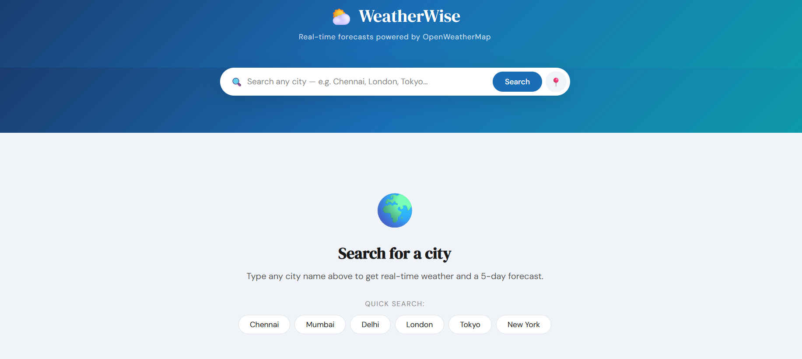
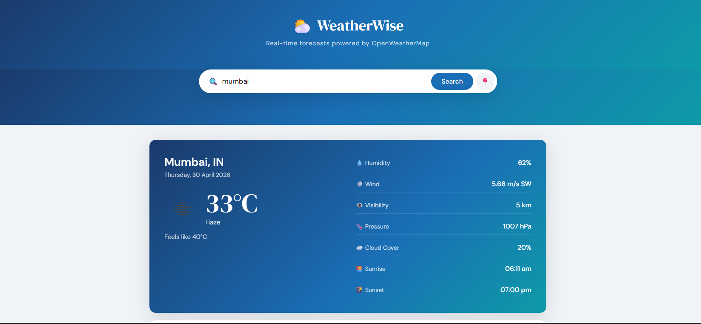
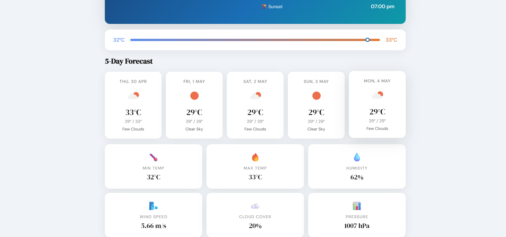

# WeatherWise — Weather Forecast Application

> Built by Ashiba Alben A · B.Tech AI & Data Science · ACEW Kanyakumari

## Tech Stack

| Layer    | Technology                      |
|----------|---------------------------------|
| Frontend | HTML5, CSS3, Vanilla JavaScript |
| Backend  | Node.js + Express.js            |
| API      | OpenWeatherMap (via backend proxy) |
| Cache    | node-cache (10 min TTL)         |
| Security | Helmet, CORS, Rate Limiting     |
| Deploy   | Render.com                      |

## Features
- 🔍 City search with autocomplete
- 📍 GPS-based location detection
- 🌡️ Current weather with full details
- 📅 5-day forecast
- 🎨 Dynamic UI based on weather condition
- ⚡ Backend caching for performance
- 🔒 API key hidden on backend (never exposed to frontend)
- 📱 Fully responsive

## API Endpoints

| Method | Endpoint | Description |
|--------|----------|-------------|
| GET | /api/weather?city=Chennai | Current weather |
| GET | /api/forecast?city=Chennai | 5-day forecast |
| GET | /api/search?q=Chen | City autocomplete |
| GET | /api/health | Health check |

## Setup

```bash
# 1. Install
npm install

# 2. Create .env
cp .env.example .env
# Add your OpenWeatherMap API key

# 3. Run
npm run dev
```

Open: http://localhost:4000
## Screenshots





---
Built by **Ashiba Alben A** · Kanyakumari, Tamil Nadu
